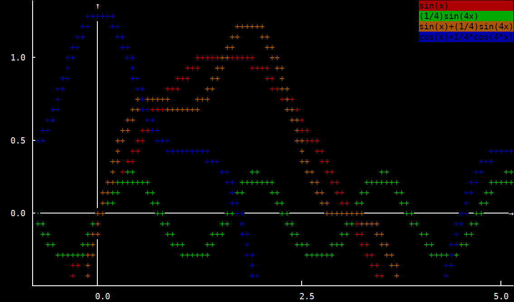

# NCGraph
Python NCurses Grapher Class

## Usage

The `grapher` object has a very simple usage. Setup your curses application and give the grapher a window. Setup two or more data sets as lists. Attach the grapher to the window and plot the data sets.

``` Python
x, y = [], []
x = [i for i in numpy.arange(-3.5, 3.5, 0.01)]
ya = [math.sin(i) for i in x]
yb = [(1/4)*math.sin(4*i) for i in x]
yc = [math.sin(i) + (1/4)*math.sin(4*i) for i in x]
myGrapher = Grapher(stdscr)
myGrapher.plot(x, ya, label="sin(x)")
myGrapher.plot(x, yb, label="(1/4)sin(4x)")
myGrapher.plot(x, yc, label="sin(x)+(1/4)sin(4x)")
```


